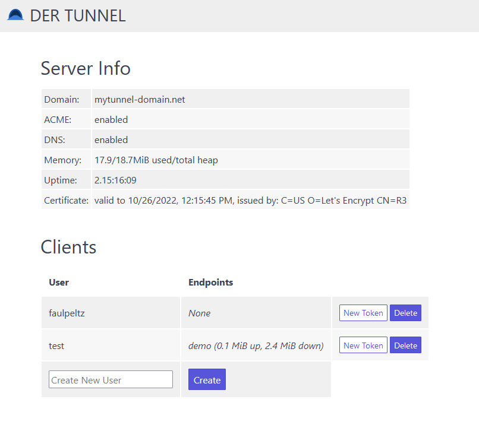

# DerTunnel

DerTunnel is a Node-based client/server TCP tunnel forwarding proxy similar to ngrok, but intended for self-hosting.

Features:

* Easy to setup
* Includes a DNS server for delegation of a subdomain for the managed tunnel endpoints
* Includes an ACME client for creating a wildcard certificate for the tunnel endpoints (using the DNS-01 challenge and the included DNS server)
* Simple admin UI for adding users and replacing token
* Docker image for hosting the server
* npm client package for programmatic use

---



## Installation

Currently it is required to build from source. Clone from git and run:

```bash
# For the server:
npm run server
```

```bash
# For the client:
npm run client -- demo 4000
```

The client cli will ask for configuration information if no config files are found.
The server can be run with ``--setup`` for initial configuration.
Server and client can also be bundled to stand-alone JS files and packaged with ``pkg`` to self-contained binaries:

```bash
# Bundle
npm run bundle
```

```bash
# Bundle & Package
npm run package
```

Use the ```Dockerfile``` in ```docker/``` to build the server docker image.

A client-only npm pacakge with typings is available in ``packages/dertunnel`` or from npm as
``@faulpeltz/dertunnel``

## Usage

### Server

The server stores service configuration in ``data/server.json``, client tokens (hashed) in ``data/clients.json`` and certificates in ``data/acme_tunnel.(crt|key)``.
The server exposes a TLS server socket which is used by the tunnel clients (``service.<yourdomain>``), the clients connecting to the public endpoint (``demo-1234.<yourdomain>``) as well as the browser clients for the admin UI (``admin.<yourdomain>``)

>DNS Setup requires an A record for your server instance and a NS record for the subdomain pointing to this record (e.g. A mytunnel.foo.com 1.2.3.4 and NS tunnel.foo.com mytunnel.foo.com)

### Client

The client stores its configuration in the user profile depending on the OS (``dertunnel-nodejs/Config/config.json``)
The client creates an outbound TLS connection to the server on the configured port and connects to the local endpoints using TCP (TLS currently not supported)

> When using the client library (``@faulpeltz/dertunnel``), the configuration needs to be passed to the ```connectTunnel()``` function, which returns a cleanup function for when the tunnel is no longer needed.

## Contributing

Pull requests are welcome. For major changes, please open an issue first to discuss what you would like to change.

Please make sure to update tests as appropriate.

## Bundled dependencies

Uses [Spectre CSS](https://picturepan2.github.io/spectre/) (MIT) for the admin UI

## License

(c) faulpeltz
[MIT](https://choosealicense.com/licenses/mit/)
